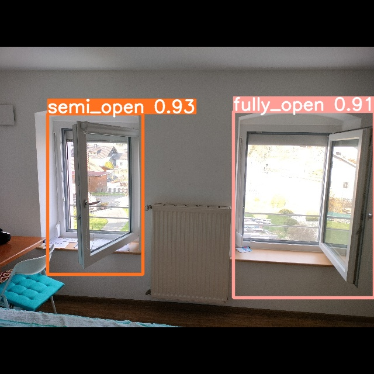

# Windows State Recognition with YOLOv5

[demo](assets/demo.gif)

## Introduction

This project is a Windows state recognition system based on YOLOv5. The system can recognize the state of the window, such as open, close, tilted and semi-open. The system can be used in the field of smart home, smart office, and other fields.

The system is based on the YOLOv5 repository. The YOLOv5 repository is a PyTorch implementation of YOLOv5. The YOLOv5 repository is developed by Ultralytics. The YOLOv5 repository is available at [YOLOv5 repository](https://github.com/ultralytics/yolov5).

The system is trained on the Windows State Dataset available on Kaggle. Refer to the [Dataset](#dataset) section for more information.

## Installation

1. Clone the repository

```bash
git clone https://github.com/Bharadhwajsaimatha/windows_state_recognition_yolov5.git
```

2. Setup the YOLOv5 environment

Follow the instructions in the [YOLOv5 repository](https://github.com/ultralytics/yolov5) to setup the YOLOv5 environment.

3. Install the required packages

```bash
pip install -r requirements.txt
```

## Usage

1. Run the following command to start the system

```bash
python detect.py --weights yolov5s.pt --source 0                               # webcam
                                               img.jpg                         # image
                                               vid.mp4                         # video
                                               screen                          # screenshot
                                               path/                           # directory
                                               list.txt                        # list of images
                                               list.streams                    # list of streams
                                               'path/*.jpg'                    # glob
                                               'https://youtu.be/LNwODJXcvt4'  # YouTube
                                               'rtsp://example.com/media.mp4'  # RTSP, RTMP, HTTP stream
```

- The best weights can be found in the `best.pt` file in the repository.
- The system can be run on the webcam, image, video, screenshot, directory, list of images, list of streams, glob, YouTube, RTSP, RTMP, and HTTP stream.

2. A few test videos are provided in the `test_videos` directory.

## Dataset

The dataset used to train the model is the [Windows State Dataset](https://www.kaggle.com/datasets/bharadhwajsaimatha/windows-open-closed-semi-tilted-dataset/data) available on Kaggle.

## Results

The system can recognize the state of the window with an accuracy of 92.5%. The system can recognize the state of the window in real-time.



## Contributions

Contributions are welcome! For feature requests and bug reports, please submit a GitHub issue.

## License

This project is licensed as per the YOLOv5 repository. Please refer to the [YOLOv5 repository](https://github.com/ultralytics/yolov5) for more information.

If you find this project useful, please give it a star ⭐.

